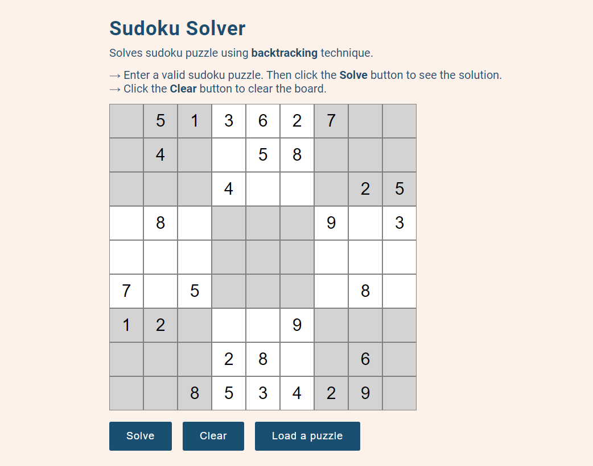
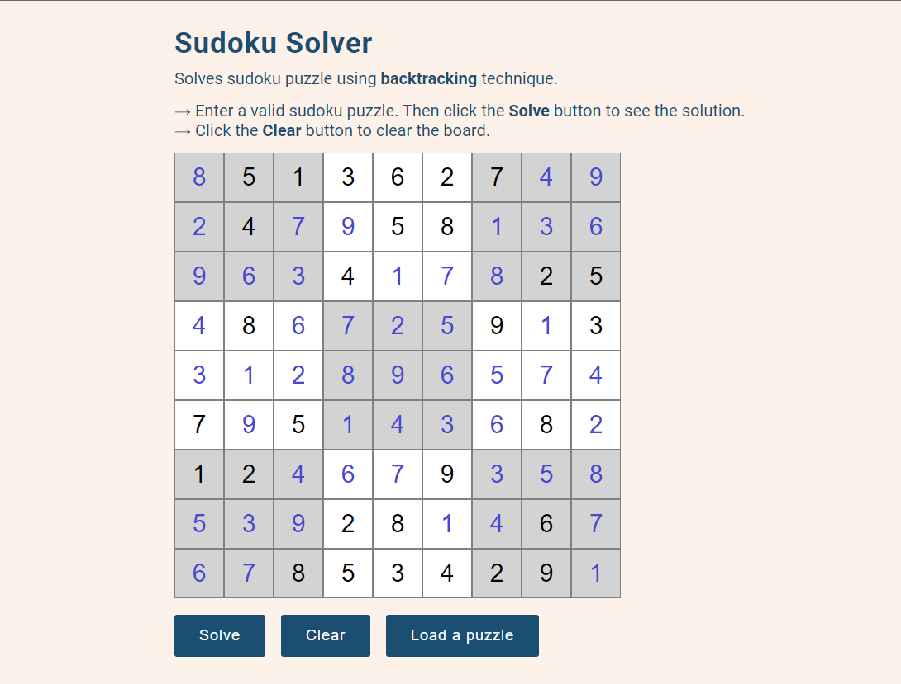

# Sudoku-Solver

Sudoku puzzle solver using backtracking technique.\
[Live Demo](https://sudokoo.netlify.app/)

## Input a valid sudoku puzzle:

## See the solution:

---

## Todo

### 모든 빈칸을 채워 전체 보드를 완성하세요

나머지 빈 칸을 채우는 방식은 다음과 같습니다.

1. 각각의 가로줄과 세로줄에는 1부터 9까지의 숫자가 한 번씩만 나타나야 한다.
2. 굵은 선으로 구분되어 있는 3x3 정사각형 안에도 1부터 9까지의 숫자가 한 번씩만 나타나야 한다.
